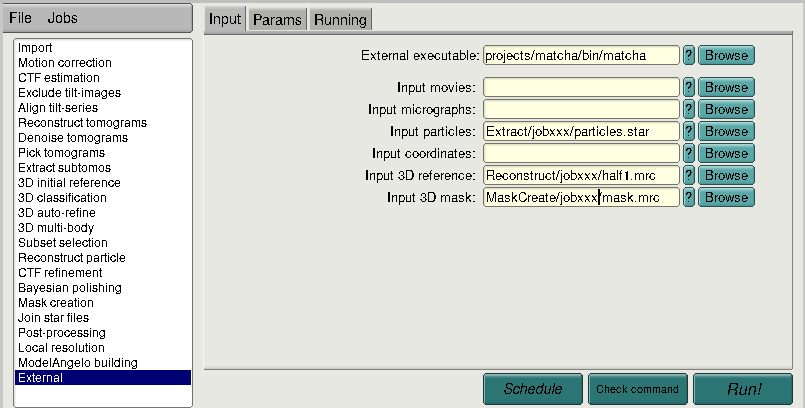
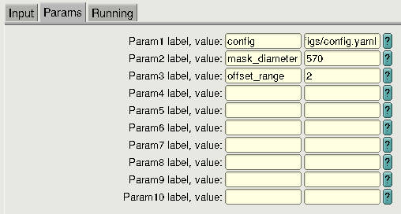

# Matcha: Fast Volume Alignment by Frequency-Marched Newton

> Official implementation of **"Fast Volume Alignment by Frequency-Marched Newton"**

> Paper: [Fast Volume Alignment by Frequency-Marched Newton](https://arxiv.org/abs/2603.15285)
> Authors: Fabian Kruse, Valentin Debarnot, Vinith Kishore, Ivan Dokmanić

Matcha aligns volumes against a reference template via continuous SO(3) optimisation with frequency-marched Newton refinements. It can be integrated into subtomogram alignment for rapid Subtomogram Averaging (STA) in Cryo-ET and runs as a stand-alone CLI tool or directly as a **RELION External job**.


---

## Contents

- [Requirements](#requirements)
- [Installation](#installation)
- [Benchmark example](#benchmark-example)
- [Full alignment](#full-alignment)
- [RELION External job](#relion-external-job)
- [Tips](#tips)
- [Project layout](#project-layout)

---

## Requirements

|              |                                                     |
| ------------ | --------------------------------------------------- |
| Python       | ≥ 3.12                                              |
| GPU          | CUDA-capable (required for alignment and benchmark) |
| Dependencies | `pyproject.toml` / `requirements.txt`               |

---

## Installation

**From a local clone** (recommended for development):

```bash
git clone https://github.com/swing-research/Matcha matcha
cd matcha
pip install -e .
```

**Directly from the repository:**

```bash
pip install "git+https://github.com/swing-research/Matcha.git"
```

After installation, `matcha` and `matcha-example` are available on your `PATH`.

In a source checkout, the top-level `configs/` and `data/` paths are convenience links to the canonical packaged resources under `src/matcha/`.

The installed package bundles the default configs and lookup tables, so `matcha --config config.yaml --align` and `matcha-example --config config_example.yaml` work outside a source checkout.

Inspect the CLI with `matcha --help` or `matcha-example --help`.

For RELION `External` jobs, make sure RELION runs in the same Python environment, or that the queue submission environment activates it before launching Matcha.

**Without installation** — use the bundled launchers, which set `PYTHONPATH` automatically:

```bash
./bin/matcha         --config config.yaml --align
./bin/matcha-example --config config_example.yaml
```

---

## Benchmark example

Benchmarks the orientation-search back-end on synthetically rotated and noise-corrupted copies of a template volume.

### Step 1 — download the template

The example config uses a ribosome map from [EMPIAR-10045](https://www.ebi.ac.uk/empiar/EMPIAR-10045/)
(Bharat & Scheres, _Nature Protocols_ 2016):

```bash
wget -P data/ https://ftp.ebi.ac.uk/empiar/world_availability/10045/data/ribosomes/AnticipatedResults/Refine3D/run2_class001.mrc
```

The config already points to `data/run2_class001.mrc` — no further edits needed.

### Step 2 — run

```bash
# without installation:
./bin/matcha-example --config config_example.yaml

# installed CLI:
matcha-example --config config_example.yaml

```

Optionally write metrics to JSON:

```bash
./bin/matcha-example --config config_example.yaml --metrics_out results.json
```

### Expected output

```
Results of 1000 volumes at snr 0.0dB:
Mean distance (deg):              X.XX°
Median distance (deg):            X.XX°
90th percentile distance (deg):   X.XX°
search_orientations timing: mean=XX.XX ms, std=XX.XX ms, total=XX.XX s for 1000 volumes, ...
```

---

## Full alignment

Edit `configs/config.yaml` to point to your data. In a source checkout, `configs/` is a convenience link to the packaged defaults:

| Field                 | Description                               |
| --------------------- | ----------------------------------------- |
| `path_templates`      | List of two half-map `.mrc` files         |
| `path_template_mask`  | Optional mask `.mrc` (leave `""` to skip) |
| `particles_starfile`  | RELION STAR file with particle metadata   |
| `gpu_ids`             | List of GPU indices to use                |
| `box_size`            | Box size in pixels                        |

The volume- and voxel-size are read automatically from the template MRC header.

Batching notes:

- `num_subtomograms_per_batch: "auto"` starts from a small probe batch (default `4`), grows upward, and keeps the largest verified-safe batch size.
- `auto_batch_safety` controls how much free VRAM to leave unused during auto mode; lower it if your GPU or scheduler limits are tight.
- Set `num_subtomograms_per_batch` to an integer to bypass probing entirely, or set `auto_batch_probe_start` to change the initial auto-probe batch.

Then run:

```bash
# without installation:
./bin/matcha --config config.yaml --align

# installed CLI:
matcha --config config.yaml --align

```

---

## RELION External job

Matcha can be used directly as a RELION External executable:

```bash
matcha --o External/jobXXX/       \
       --in_parts  <particles.star>      \
       --in_3dref  <half1_or_half2.mrc>  \
       --in_mask   <mask.mrc>            \
       --j         <threads>
```

<table>
  <colgroup>
    <col style="width: 35%;">
    <col style="width: 65%;">
  </colgroup>
  <thead>
    <tr>
      <th>Behaviour</th>
      <th>Details</th>
    </tr>
  </thead>
  <tbody>
    <tr>
      <td>I/O override</td>
      <td><code>--o</code>, <code>--in_parts</code>, <code>--in_3dref</code>, <code>--in_mask</code>, <code>--j</code>, GPU flags override the config</td>
    </tr>
    <tr>
      <td><code>--mask_diameter</code></td>
      <td>Mask diameter in Å (same as the RELION GUI field). Sets <code>box_size = round(mask_diameter / voxel_size)</code></td>
    </tr>
    <tr>
      <td><code>--offset_range</code></td>
      <td>Shift search radius in pixels (same as the RELION GUI "Offset range" field). Overrides <code>shift_search_radius</code> in the config</td>
    </tr>
    <tr>
      <td>Half-map pair</td>
      <td>If <code>--in_3dref</code> contains <code>half1</code>/<code>half2</code>, the counterpart is required at the same location</td>
    </tr>
    <tr>
      <td>Single map</td>
      <td>If neither tag is present, the same map is used for both halves</td>
    </tr>
    <tr>
      <td>Particle split</td>
      <td>Particles are split randomly into two halves from the input STAR</td>
    </tr>
    <tr>
      <td>Output</td>
      <td>Particles STAR written to <code>&lt;--o&gt;/matcha_particles.star</code>; config copied to <code>&lt;--o&gt;/matcha_config.yaml</code></td>
    </tr>
    <tr>
      <td>Lifecycle files</td>
      <td><code>RELION_JOB_EXIT_SUCCESS</code> / <code>RELION_JOB_EXIT_FAILURE</code> and <code>RELION_OUTPUT_NODES.star</code> written to <code>&lt;--o&gt;</code></td>
    </tr>
  </tbody>
</table>

### RELION GUI setup

To run Matcha as a RELION `External` job from the GUI, create a new `External` job and fill the `Input` tab as follows:

Before creating the `External` job, make sure the subtomogram extraction job `Extract subtomos` was run with 3D output enabled: choose either `3D subtomos` or `3D pseudo-subtomos` during extraction.

For queued RELION jobs, make sure the submission environment loads the Matcha Python environment before launching the `External` executable.

- **External executable**: path to `matcha` or `bin/matcha`
- **Input particles**: your subtomogram STAR file, for example `Extract/jobxxx/particles.star`
- **Input 3D reference**: one half-map, for example `Reconstruct/jobxxx/half1.mrc`
- **Input 3D mask**: optional mask, for example `MaskCreate/jobxxx/mask.mrc`

If the reference path contains `half1` or `half2`, Matcha automatically resolves the matching counterpart in the same directory.

<p align="center">
  
</p>

In the `Params` tab, pass the Matcha config file and the RELION-specific overrides:

- `config`: Matcha YAML file, for example `config.yaml` or `configs/config.yaml` in a source checkout
- `mask_diameter`: mask diameter in Angstrom, matching the RELION GUI field
- `offset_range`: shift search radius in pixels, matching the RELION GUI field

<p align="center">
  
</p>

---

## Tips

**Numba cache path** — on HPC systems with restricted home directories, set:

```bash
export NUMBA_CACHE_DIR=/tmp/numba_cache
```

**Orientation-search back-end** — select via `orientation_search.method` in `config_example.yaml`:

| Method     | Description                                                                      |
| ---------- | -------------------------------------------------------------------------------- |
| `"matcha"` | Frequency-marched Newton solver — fast, recommended                              |
| `"sofft"`  | SO(3) FFT exhaustive grid search — slower or less accurate, useful as a baseline |

---

## Project layout

```
matcha/
├── bin/                       # Shell launchers for source checkouts
│   ├── matcha
│   └── matcha-example
├── configs -> src/matcha/configs   # Convenience link to the canonical config files
├── data -> src/matcha/data         # Convenience link to the canonical lookup tables
├── src/
│   └── matcha/
│       ├── run.py             # Main CLI entry point
│       ├── example.py         # Benchmark CLI
│       ├── align_subtomograms.py
│       ├── configs/           # Canonical packaged default configs
│       ├── data/              # Canonical packaged lookup tables
│       ├── core/              # Alignment, SO(3), and correlation kernels
│       └── utils/             # I/O, setup, batching, and rotation helpers
├── tests/                     # Lightweight package/install smoke tests
├── pyproject.toml
└── LICENSE
```
